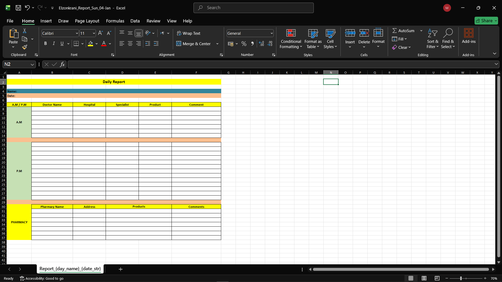

# 🤖 MedMap Bot (Medical Rep Reporting Bot)

A specialized Telegram bot designed for **Medical Representatives** to efficiently log daily doctor and pharmacy visits and automatically generate organized Excel reports.

## 🌟 Key Features
* **Standard Industry Formatting**: Generates Excel reports that follow the **standard professional layout** widely recognized and used by Medical Representatives in the pharmaceutical industry.
* **Visual Report Preview**:

* **Multi-User Support**: Handles multiple users simultaneously by creating unique files based on the user's name and Telegram ID.
* **Visit Categorization**: Organizes entries into three distinct sections: **A.M.** (Morning), **P.M.** (Evening), and **Pharmacy** visits.
* **Professional Styling**: Automatically applies color coding, cell borders, and header alignment to match official company report standards.
* **Data Security**: Utilizes `.env` and `.gitignore` to keep sensitive bot tokens and private environment variables secure.

## 📂 Project Structure
* `main.py`: The core script containing the bot logic, command handlers, and data processing.
* `reports/`: The directory where generated Excel files are stored.
* `requirements.txt`: Lists the necessary Python libraries like `python-telegram-bot` and `openpyxl`.
* `.gitignore`: Ensures temporary files and secrets are not uploaded to GitHub.
* `git_hup_excel_form.png`: Sample image of the generated report format.

## 🚀 How to Use
1. Send the `/start` command to the bot on Telegram.
2. Select **"📊 Create New Report"**: The bot will prompt you for your **First Name** and **Last Name** to initialize your personal file.
3. Select **"✅ Register New Visit"**: Follow the prompts to enter the doctor's name, specialty, location, and products discussed.
4. Select **"📤 Send Report"**: The bot will instantly send you the formatted Excel file for the current day.

## 🛠 Tech Stack
* **Python 3.x**
* **Library:** `python-telegram-bot` (For Telegram API interaction).
* **Library:** `openpyxl` (For generating and styling Excel workbooks).
* **Hosting:** `Railway` (For 24/7 cloud deployment).

## ⚠️ Important Note for Railway Users
Since Railway uses **Ephemeral Storage**, files stored in the `reports/` folder may be deleted if the service restarts or redeploys. It is highly recommended to use the **"Send Report"** button and download your file as soon as you finish your daily visits to ensure no data is lost.
